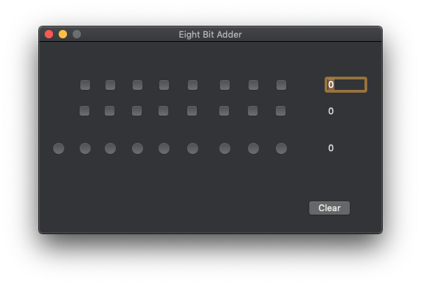

# Circuits
Playing around with basic computer circuits in software. Written in Swift in XCode.

This project is following along as I read <a href="https://www.amazon.com/Code-Language-Computer-Hardware-Software/dp/0735611319">Code: The Hidden Language of Computer Hardware and Software</a>.

